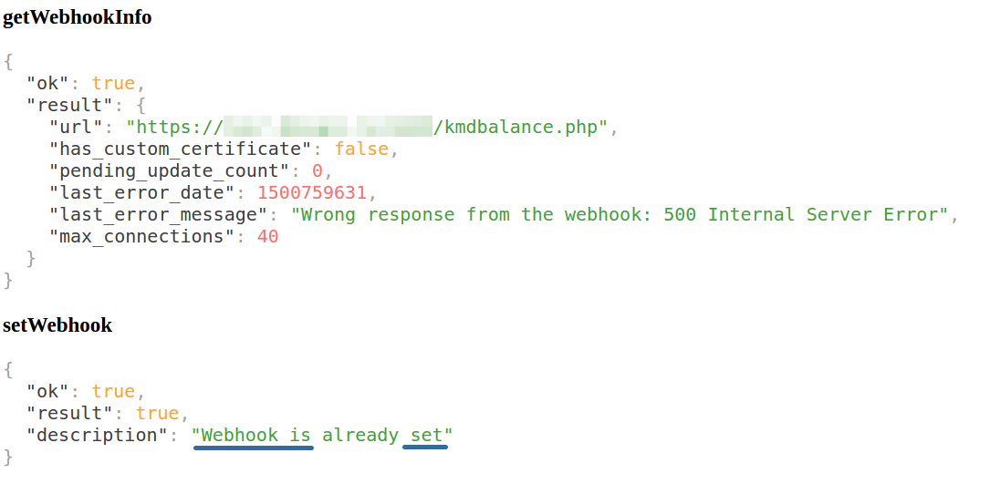
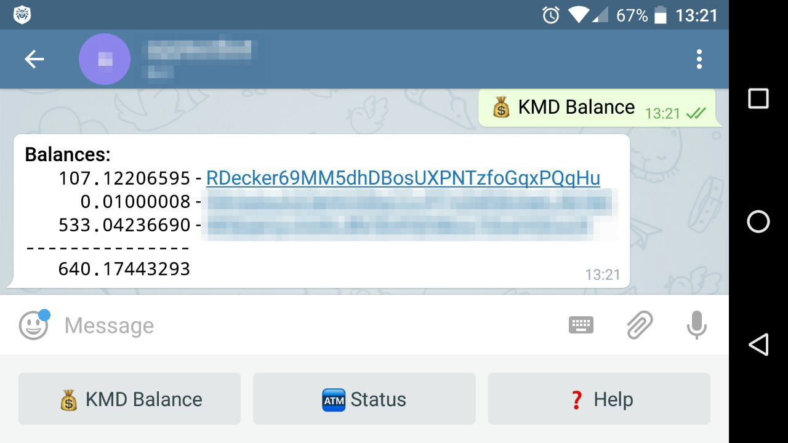

# komodod <-> telegram interaction script

Simple Telegram bot that can display balances from your Komodo full node.

### Common installation guide:

**1.** Before you start expected that you have some expirience in web-server setup, manage SSL certificates, and [Telegram Bot API](https://core.telegram.org/bots/api) . If don't - no trouble, but the process can be more difficult for you. Also you'll need a host with HTTP server and SSL enabled. I recommend you to use Ubuntu LAMP server and in this guide we will use default Ubuntu LAMP installation. We need Apache (with SSL support) + PHP with OpenSSL and CURL modules enabled.

**2.** Be sure that your Apache is setupped correctly and have access from internet, also you'll need a domain name for your host (i.e. example.org). Your host should opens from internet like http://example.org . Read this guilde [How To Create a SSL Certificate on Apache for Ubuntu 14.04](https://www.digitalocean.com/community/tutorials/how-to-create-a-ssl-certificate-on-apache-for-ubuntu-14-04) and enable SSL support in your Apache.

**3.** Go here - [SSL For Free](https://www.sslforfree.com/) and obtain SSL certificates for your domain (this is just very fast way, you will get 90 days SSL cert for free, of course, you can get cert in any other place). Attach certs to your Apache. Make sure that your domain is accessible from internet via SSL.

**4.** Place [kmdbalance.php](https://github.com/DeckerSU/komodo-telegram-bot/blob/master/kmdbalance.php) in your domain's root, change the configurations options in it. Before you make this step Create the bot in Telegram - [How do I create a bot?](https://core.telegram.org/bots#3-how-do-i-create-a-bot) and read this amazing guide about webhooks - [Marvin's Marvellous Guide to All Things Webhook](https://core.telegram.org/bots/webhooks) . When the all is completed open this URL: https://example.org/kmdbalance.php (example.org in this - is a name of your domain) in browser to register a webhook. You should see something like that:

 

setWebhook should report that webhook is set or already set. 

**5.** Start your Telegram client and try to talk with your own KMD Balance bot.

### Example

Desktop Client:

 

Mobile Client:

 

Looks nice ;)

### Postscriptum

- Greetz to [@kolo](https://sprnt.slack.com/messages/@kolo) and thx him for the main idea. 
- Feel free to donate [RDecker69MM5dhDBosUXPNTzfoGqxPQqHu](http://kmd.explorer.supernet.org/address/RDecker69MM5dhDBosUXPNTzfoGqxPQqHu) , if this small project is useful for you.
- If you have any ideas, questions or something else - plz, use [issues](https://github.com/DeckerSU/komodo-telegram-bot/issues)  section. Pull requests are welcome.
